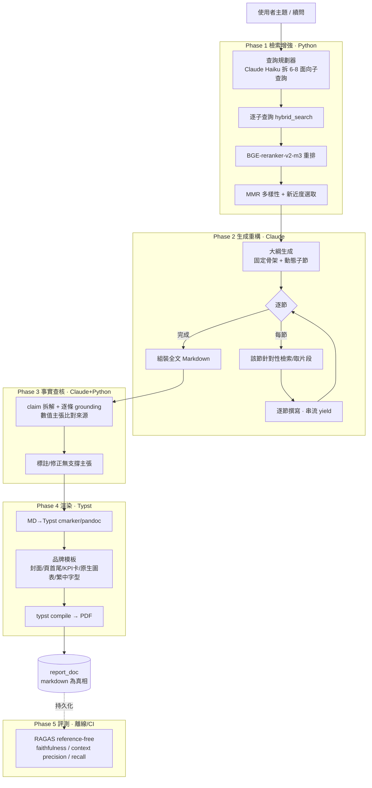

# 廷豐智能研報 — 研報生成改善架構藍圖

> 目標：在**不破壞**「Python 管確定性、Claude 管語意、以 `file_hash` 為鍵、checkpoint 可續」這個核心分層的前提下，把「深度研報」的**內容品質**與**輸出質感**一起拉到可交付水準，並讓品質**可量測、防回歸**。
>
> 決策前提（已確認）：全端藍圖；品質優先（單份深報可接受數分鐘）；評測採 reference-free 指標（無黃金答案）。

---

## 0. 現況盤點：內容深度的天花板在哪

目前 `app/services/report.py` 的 `generate_report()` 流程：

```
embed_query_cached(question)            # 對「原始問題」做單一向量
  → hybrid_search(k=30, dense_scan=400) # 一次性檢索
  → build_context(25 篇 / 6 段 / 40k 字) # 相關度+新近度砍量，無多樣性、無重排
  → stream_completion(單次 40k 字長輸出) # 一次寫完整份，無大綱、無逐段
  → strip_preamble → WeasyPrint(pdf.py) → report_doc
```

對照品質瓶頸：

| 現況 | 問題 | 對應改善 |
|---|---|---|
| 單一 query 一次檢索 | 「台積電展望」一個向量撈不齊風險/估值/產業鏈面向 | **多角度查詢分解**（Phase 1） |
| dense+lexical 融合、無 reranker | 進脈絡的片段精準度受限，faithfulness 低 | **BGE-reranker-v2-m3 重排**（Phase 1） |
| `build_context` 只看 tier/相關度/新近度 | 25 篇可能同質，缺證據多樣性 | **MMR 多樣性選取**（Phase 1） |
| 單次 40k 字一次寫完 | 合成淺、易漏段、長輸出品質不穩 | **大綱→逐段生成 + 逐段檢索**（Phase 2） |
| `[n]` 引用與 ```chart 數據「要求」對應但**無查核** | 金融數字幻覺零防線（最致命） | **claim grounding 事實查核**（Phase 3） |
| 手刻 WeasyPrint + `pdf.py` 注入（CLAUDE.md 標記 fragile） | 質感天花板受限、注入邏輯脆弱 | **Typst 模板化渲染**（Phase 4） |
| 無任何品質量測 | 改 prompt/檢索憑感覺、無法防退步 | **RAGAS reference-free 評測**（Phase 5） |
| `answer_question` 920 行 god-generator、裸 tuple `row[_RID]` | 難測、易位移錯位 | **重構地基**（Phase 0） |

---

## 1. 設計原則

1. **不換框架，只採元件與模式。** 不整包吞 LlamaIndex/Haystack（會跟現有 CLI-LLM + 確定性 Python 分層打架）。reranker 是一個模型、STORM/GPT-Researcher 當**參考架構**移植、RAGAS 當評測。
2. **維持 Markdown 為 source of truth。** 生成端仍吐 Markdown，渲染端可替換（先 WeasyPrint、後 Typst），`report_doc.markdown` 永遠可重建 PDF。
3. **確定性歸 Python、語意歸 Claude。** 分解子查詢、逐段規劃、事實查核的「判斷」交 Claude；檢索、重排、選取、評分、落地全部 Python 決定性。
4. **每個階段 checkpoint 化、可續、可觀測。** 沿用現有 `_StageTimer` 精神，新階段（decompose/rerank/section-draft/verify）都要有計時與可獨立重跑。
5. **品質先可量測再優化。** 先建 reference-free eval 基準線，之後每個 Phase 的增益都用同一組指標驗證。
6. **fail-open 不惡化可用性。** 任一增強階段（reranker 載入失敗、分解逾時、查核異常）都退回現有行為，不讓研報生不出來。

---

## 2. 端到端架構總覽



品質優先取捨落在：**Phase 1 的逐子查詢檢索 + rerank** 與 **Phase 2 的逐節生成** 會顯著增加耗時（多輪 LLM + 多次檢索），這是換取深度與準度的主要成本。延遲預算見 §6。

---

## 3. 分層設計

### Phase 0 — 重構地基（先做，讓後面每一步可測）

這是後續所有改動的安全網，本身不改行為。

- **型別化檢索 row。** 在 `store.py` 邊界把 `search_chunks_meta/_lexical` 的裸 tuple 換成 `NamedTuple`（`chunk_id, report_id, file_name, market, report_date, content, distance, …`）。消滅 `answer.py:132` 的 `_RID, _FNAME... = 1,2,3,6,14` 位移風險（schema 是 `ALTER ADD COLUMN` 增量演進，位移遲早出事）。
- **抽共用檢索 helper。** `retrieve_context(question, *, k, max_reports, ...) -> (sources, context)` 供問答與研報共用，取代 `report.py` 與 `answer.py` 各寫一次的 `embed→hybrid_search→build_context`。
- **拆 `answer_question` 的串流狀態機。** 把 EXT_SENTINEL buffering 抽成 `SentinelStreamParser`，並補單元測試（跨 chunk 邊界切割是最易出錯處）。
- **收斂 config。** `ASK_*`/`REPORT_*` 二十幾個 env（`ASK_DENSE_SCAN` 甚至在兩檔各定義一次）收進一個 `ReportConfig` dataclass 載入一次，調參面可發現、可測。

> 產出模組建議：`app/services/rows.py`（型別）、`app/services/retrieval_pipeline.py`（共用 helper）、`app/config.py`（集中設定）。

### Phase 1 — 檢索增強（內容覆蓋度與精準度的最大槓桿）

新增 `app/services/query_planner.py` 與 `app/services/rerank.py`，插在現有 `hybrid_search` 前後，**完全落在「Python 管檢索」層**。

1. **多角度查詢分解（採 STORM / GPT-Researcher 模式）。**
   用 Haiku 把主題展開成 6–8 個面向子查詢（財報表現、產業鏈/供需、競爭格局、風險因子、估值、催化劑、總經連動…；面向清單可依 `market` 微調）。每個子查詢各自跑 `hybrid_search`。這對應 STORM 的「多視角提問」與 GPT-Researcher `DetailedReport` 的子問題分解。
   - fail-open：分解失敗 → 退回單一 query（現況）。

2. **BGE-reranker-v2-m3 重排（採同家族開源模型）。**
   合併所有子查詢召回的 chunk 去重後，用 cross-encoder 對 `(主題, chunk)` 重新打分取 top-N。你已在跑 BGE-M3 embedder，同家族 reranker 零學習成本、多語（含中文）、CPU 可跑。實測可將 context precision 與 faithfulness 顯著拉高。
   - 落點：`hybrid_search` 之後、選取之前；沿用 `_StageTimer` 記 `rerank_ms`。

3. **MMR 多樣性 + 新近度選取（取代純相關度砍量）。**
   在 `build_context` 的選篇政策加入 MMR（相關度 vs. 已選集合的冗餘度權衡），避免「25 篇同質研報」。與既有 tier/新近度/過舊配額並存：先 rerank 分數與新近度定基礎序，再用 MMR 去冗餘。

> 建議把「選篇政策」從 `build_context` 抽成純函式 `select_reports(candidates) -> list`，與字串格式化分離、可單獨測；同時和 `retrieval.rank_reports`（目前 BAND_WIDTH=0.05，與問答路徑 RELEVANCE_BAND=0.10 兩套會漂移）合流到同一套定義。

### Phase 2 — 生成重構（大綱→逐節，取代單次 40k 字）

新增 `app/services/report_writer.py`，把 `generate_report` 的「一次寫完」換成 plan-and-write（STORM / GPT-Researcher `DetailedReport` 的核心）：

1. **大綱生成。** 以現有固定骨架（執行摘要／關鍵發現／重點分析／風險與展望／引用來源）為外層，讓模型依檢索到的證據補**動態子節**（例如重點分析下細分為「先進封裝」「HBM 需求」「地緣風險」）。輸出結構化大綱（JSON）。
2. **逐節針對性檢索。** 每個子節用該節標題 + 主題再取一次相關片段（從 Phase 1 的候選池挑，或對該節做一次 rerank），只餵該節相關證據，而非全份共用一坨 40k 字。
3. **逐節撰寫 + 串流。** 一節一節寫，天然貼合你現有的 `("token", …)` 串流（前端逐節浮現）。每節帶自己的來源編號、句末 `[n]`。
4. **組裝。** 串接為完整 Markdown，統一重編來源編號、收斂 `## 引用來源`。
   - fail-open：大綱或逐節任一步異常 → 退回現有「單次生成」路徑，研報照樣產出。

> 這一步是「品質優先」取捨的主要耗時來源：N 個子節 = N 次（檢索 + LLM 撰寫）。用 §6 的並行策略壓延遲。

### Phase 3 — 事實查核（金融研報的紅線）

新增 `app/services/faithfulness.py`，採 **RAGAS 的 faithfulness 演算法**（reference-free，不需黃金答案）：

1. **claim 拆解。** 把生成研報拆成子主張（statements），特別標記**數值型主張**（營收年增、毛利率、EPS、目標價…）。
2. **逐條 grounding。** 每條主張比對其宣稱來源 `[n]` 對應的片段，判斷「被支持 / 未被支持 / 無來源」。
3. **處置。**
   - 未被支持的數值主張 → 標註並要求模型改寫或移除（可做一輪 targeted 修正）。
   - 產出 `faithfulness_score` 一併寫入 `report_doc`（新增欄位，沿用 `ALTER ADD COLUMN IF NOT EXISTS` 慣例），低於門檻可在 UI 顯示「內容審核中/信心較低」徽章。
   - fail-open：查核異常不阻擋交付，僅不加分數。

### Phase 4 — Typst 渲染層（取代 WeasyPrint 手刻）

新增 `app/services/typst_render.py`，逐步取代 `pdf.py` / `chart.py`：

- **MD→Typst：** 用 `cmarker`（CommonMark→Typst）或 pandoc 把 `report_doc.markdown` 轉進 Typst 模板；Markdown 仍是真相，渲染可回退 WeasyPrint。
- **品牌模板 `template.typ`：** 封面、頁首頁尾、KPI 卡片、`## 引用來源` 樣式，全部宣告式定義在一支模板，解掉 `inject_kpi`/`inject_charts` 的 fragile。
- **```kpi / ```chart 對應：** 你既有的 fence JSON 規格直接映射成 Typst 函式呼叫；圖表用 Typst 原生繪圖套件（cetz / lilaq）繪製，可**退役 `chart.py` 的 matplotlib 依賴**，圖風與整份研報一致。
- **繁中字型（遷移最大雷）：** 明確指定 CJK 字型（思源宋體 / Noto Serif CJK TC），部署機需安裝字型，否則豆腐字。
- **依賴：** 多一個 `typst` binary 或 `typst` PyPI 套件；systemd 服務 PATH 要處理（同你現在 `claude` CLI 的狀況）。

> 遷移策略：以 env flag（`REPORT_RENDERER=weasyprint|typst`）並行雙軌，Typst 穩定後再切預設，`report_doc.markdown` 讓兩者隨時可重建、可 A/B。

### Phase 5 — Reference-free 評測地基（把「保證品質」釘死）

新增 `eval/`（離線，不進 web 服務路徑）：

- **題庫來源：** 從 `qa_log` / 既有研報主題萃取一組固定評測題（無需人工黃金答案）。
- **指標（RAGAS，reference-free）：** Faithfulness（目標 >0.9）、Context Precision（>0.8）、Context Recall（>0.8）、Answer Relevancy（>0.85）。Faithfulness 與 Context Recall 訊號最高（分別抓幻覺與漏檢）。
- **用途：** 每個 Phase 落地前後跑同一組題，量增益、防回歸；接進 CI 當 gate（低於基準線擋合併）。
- **注意：** RAGAS 需一個評審 LLM；沿用你的 `claude` CLI（Haiku/Sonnet）即可，離線批次跑、不影響線上延遲。

---

## 4. 模組落地對應

新增（不動核心分層）：

```
app/
  config.py                 # Phase 0：集中 ReportConfig
  services/
    rows.py                 # Phase 0：型別化檢索 row
    retrieval_pipeline.py   # Phase 0：問答/研報共用 retrieve helper
    query_planner.py        # Phase 1：多角度子查詢分解（Haiku）
    rerank.py               # Phase 1：BGE-reranker-v2-m3 封裝
    select.py               # Phase 1：MMR + 新近度選篇（從 build_context 抽出）
    report_writer.py        # Phase 2：大綱→逐節生成編排
    faithfulness.py         # Phase 3：claim 拆解 + grounding
    typst_render.py         # Phase 4：MD→Typst→PDF（漸進取代 pdf.py/chart.py）
  templates/
    report.typ              # Phase 4：品牌模板
eval/
    dataset.py              # Phase 5：從 qa_log 萃取題庫
    run_ragas.py            # Phase 5：批次評測 + 報表
```

改寫：`report.py` 的 `generate_report` 變成薄編排（呼叫 planner→retrieve→writer→verify→render）；`answer.py` 共用 `retrieval_pipeline` 與 `select`。

---

## 5. 新增依賴、部署與相容性

- **Reranker 模型（BGE-reranker-v2-m3）：** 首次下載約數百 MB；`torch` 為 CPU-only（CLAUDE.md 既定），CPU 推論可行但要算進延遲預算（見 §6），必要時上批次/快取。沿用你「首次 ingest 下載 BGE-M3」的模型落地慣例。
- **Typst：** `typst` binary 或 PyPI 套件 + CJK 字型安裝；systemd drop-in 補 PATH（同 `claude` CLI 既有處理）。
- **RAGAS：** 僅離線 `eval/` 用，不進 `web/server.py` 請求路徑，不影響線上。
- **Schema：** `report_doc` 新增 `faithfulness_score`、`outline`(jsonb) 等欄位，一律 `ALTER TABLE research.report_doc ADD COLUMN IF NOT EXISTS`（無 migration 工具、保持冪等，符合現況）。
- **市場代碼／findb 對齊：** 不受影響（`TW US HK CN FX WTX MACRO GLOBAL CRYPTO` 對齊維持 `make align` 決定性重映）。
- **`make serve` 無 --reload：** 新模組上線需重啟 `report-mark-web.service`。
- **併發：** 研報維持 `REPORT_SEMAPHORE` 序列化；逐節生成與 reranker 增加單份耗時，序列化下更需 §6 的並行內縮延遲。

---

## 6. 延遲預算（品質優先，可接受數分鐘）

| 階段 | 策略 | 概估 |
|---|---|---|
| 查詢分解（Haiku） | 單次快呼叫 | ~2–5s |
| 逐子查詢檢索 ×N | **並行** `asyncio.gather` | ~3–8s |
| Rerank（CPU） | 合併候選一次批次；控候選上限 | ~3–10s |
| 選取（MMR） | 純 CPU 計算 | <1s |
| 大綱生成 | 單次 LLM | ~5–15s |
| 逐節撰寫 ×M | 節間可**部分並行**（獨立節並發，彼此依賴的順序寫）；串流回前端 | 主要成本，~90–240s |
| 事實查核 | claim 拆解可並行、grounding 批次 | ~15–40s |
| Typst 渲染 | 毫秒級編譯 | <2s |

`REPORT_TIMEOUT` 已是 600s，足夠涵蓋。關鍵是把「可並行的檢索/查核/獨立節」用 `asyncio.gather` 收斂，避免延遲線性疊加；串流逐節輸出讓使用者**感知**延遲遠低於總耗時。

---

## 7. 風險與緩解

| 風險 | 緩解 |
|---|---|
| 逐節生成使各節重複/銜接生硬 | 大綱階段先定義各節範圍與去重；組裝後做一次輕量「全文連貫性」潤飾 |
| CPU reranker 拖慢 | 限候選數上限、批次推論、結果快取；必要時只對 top-K 重排 |
| 事實查核誤殺正確主張 | 查核只「標註/建議」不硬刪；分數低走 UI 徽章而非拒發 |
| Typst 繁中豆腐字 / 遷移風險 | env flag 雙軌並行、`markdown` 可回退 WeasyPrint、先原型驗字型 |
| 新階段增加失敗面 | 每階段 fail-open 退回現有行為，可用性不倒退 |
| Prompt 契約與 parser 漂移 | 依 feature 共置 prompt+parser（citations / ext_sources / chart_block 各一模組） |

---

## 8. 分階段落地路線圖（每步以 eval 驗證增益）

1. **Phase 5-a + Phase 0：** 先建 reference-free eval 題庫拿到**基準線**，同時做重構地基（型別化 row、共用 helper）。— *沒有基準線，後面所有增益都無法證明。*
2. **Phase 1 rerank：** 加 BGE-reranker-v2-m3。最省事、faithfulness/precision 立即可量。
3. **Phase 1 多查詢分解 + MMR：** 覆蓋度與多樣性。
4. **Phase 2 大綱→逐節：** 合成深度（本藍圖最大內容躍升）。
5. **Phase 3 事實查核：** 金融數字紅線。
6. **Phase 4 Typst 渲染：** 內容穩定後再美化外觀，雙軌切換。

每一步：跑同一組 eval → 比基準線 → 沒退步才進下一步。

---

## 9. 開源專案採用對應

| 需求 | 採用 | 採用方式 |
|---|---|---|
| 多角度提問 / 大綱 / 逐節生成 | **STORM (Stanford)**、**GPT-Researcher `DetailedReport`** | 移植**架構模式**（非整包 agent；它們預設走網搜、LLM 接法不同） |
| 片段重排 | **BGE-reranker-v2-m3** | 直接接同家族模型 |
| 事實查核 | **RAGAS** faithfulness 演算法 | 借演算法（claim 拆解 + grounding） |
| 品質評測 | **RAGAS**（或 DeepEval） | 離線 eval harness + CI gate |
| PDF 渲染 | **Typst** + `cmarker`/pandoc + cetz/lilaq | 換渲染引擎，Markdown 仍為真相 |

> 明確**不採用**：LlamaIndex / Haystack 整包框架 — 會與現有 CLI-LLM + 確定性 Python 分層衝突，維護成本高於收益。

---

### 一句話總結

先用 **eval 基準線 + 重構地基**立地基，再用 **reranker → 多查詢分解 → 大綱逐節生成 → 事實查核**逐級拉高內容深度與準度，最後用 **Typst** 把外觀一次到位；全程 fail-open、Markdown 為真相、每步用 reference-free 指標防回歸。
